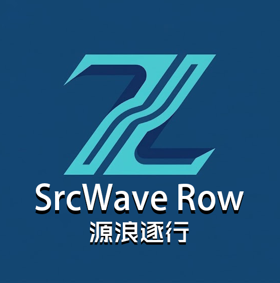

# SrcWave-Row
源浪逐行・SrcWave Row
以源代码为根基，追逐技术浪潮，逐行打磨能力，在软件工程的学习与实践中并肩前行，稳步成长。

## 团队 Logo

-设计理念
视觉符号与团队联结
LOGO 以字母 ZL 为核心视觉载体，通过几何线条共用与波浪折线造型实现 Z 与 L 的无缝融合：
Z 的流畅曲线呼应 “浪”，象征技术浪潮；
L 的利落折线呼应 “逐行”，代表代码逐行编写的严谨习惯；
同时 Z 对应团队成员张姓首字母，L 对应刘姓首字母，让标识兼具专属感与团队凝聚力。
专业内涵与精神表达
“源”：对应英文缩写 Src（Source Code），代表团队扎根软件工程核心 —— 源代码，以底层技术为根基；
“浪”：对应英文 Wave，象征技术浪潮与行业趋势，寓意团队紧跟前沿、顺势成长；
“逐行”：对应英文 Row，既指代代码逐行编写的专业习惯，也代表团队脚踏实地、稳步精进的态度；
整体向上向前的折线形态，传递出不断突破、持续成长的团队精神，贴合软件工程领域的探索与迭代特质。
视觉风格与适配性
采用极简科技风，以深浅双色蓝构建线条层次，无冗余装饰，扁平化矢量质感适配头像、徽章、文创等多场景；深蓝色背景强化专业感，文字排版清晰直观，中英文名称（SrcWave Row / 源浪逐行）完整传递团队身份。
二、生成与完善过程
需求锚定：基于团队名 “源浪逐行”（英文 SrcWave Row），明确核心设计要素：ZL 字母融合、几何切割 + 笔画共用、向上向前折线、极简线性科技风格、初始无文字。
AI 生成图标：使用 Gemini 生成基础图标，输入精准中文提示词：
极简抽象团队 LOGO，采用几何切割与笔画共用设计，将字母 Z 与 L 巧妙融合为一体，整体造型为不断向前向上的折线，线条干净利落，软件工程科技风格，扁平化矢量设计，双色科技蓝线条，无任何文字，无渐变无阴影，高清矢量质感
手动排版完善：在生成的 ZL 融合图标基础上，手动添加英文名称 SrcWave Row 与中文名称 源浪逐行，选用无衬线字体匹配极简风格，搭配深蓝色背景优化视觉对比，最终形成完整 LOGO。

## 团队成员
### 成员1：张业恒
- **个人简介**：爱好打打羽毛球、骑自行车
- **专业能力**：正在学习材料工程基础课程内容，具备基础的材料实验操作能力和数据整理分析能力。具备良好的逻辑思维、沟通协调能力和团队协作意识，善于快速接收新信息、适应新场景，对待任务认真严谨，能够高效配合团队推进项目落地，同时具备一定的自主学习和问题解决能力。
- **未来两年规划**：未来两年将重点投入考研备考，夯实专业基础、提升综合能力，全力准备研究生考试。

### 成员2：刘俊德
- **个人简介**：爱好打打羽毛球
- **专业能力**：目前正在系统学习交通运输专业基础课程，掌握基础实验操作与数据整理分析能力。具备良好的逻辑思维、沟通表达与团队协作能力，学习适应能力较强，能快速掌握新知识、融入新环境。对待工作认真细致、责任心强，可高效配合团队完成各项任务，同时具备一定自主学习与解决问题的能力。
- **未来两年规划**：未来一年全身心投入考研备考，扎实巩固专业知识、提升综合素养，全力以赴备战研究生考试。
